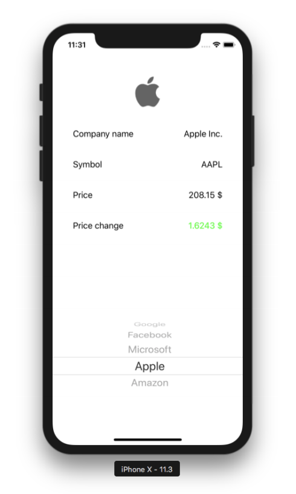

# Tinkoff_Fintech_Stocks_App
Вступительное испытание в Тинькофф финтех школу (iOS)

Задача: разработать приложение способное запросить и отобразить для выбранной
пользователем ценной бумаги (акции) информацию по ней. А именно:
* официальное название компании,
* обозначение бумаги на бирже (ticker/symbol),
* текущую цену
* изменение цены за период
